<div align="center">

# 🏢 Overlord v2

### AI Agent Orchestration Framework

[](https://github.com/twitchyvr/Overlord-v2/actions/workflows/ci.yml)
[](https://github.com/twitchyvr/Overlord-v2/releases)
[](https://www.typescriptlang.org/)
[](https://nodejs.org/)
[](https://socket.io/)
[](https://sqlite.org/)
[](LICENSE)
[](CONTRIBUTING.md)

*A scriptable, scalable, provider-agnostic framework for orchestrating AI agents through structured project phases.*

**Built on the Building / Floor / Room / Table / Chair spatial model,<br>where rooms define behavior — not agents.**

[📖 Wiki](https://github.com/twitchyvr/Overlord-v2/wiki) · [🐛 Issues](https://github.com/twitchyvr/Overlord-v2/issues) · [💬 Discussions](https://github.com/twitchyvr/Overlord-v2/discussions) · [📝 Changelog](CHANGELOG.md)

</div>

---

> **💡 The Core Insight:** *"Don't change the agent — change the framework."*
>
> When an agent enters a room, the room's rules, tools, and output templates merge into their context. Change the testing room rules once and every agent that enters inherits them. Agents are 10-line identity cards. Rooms are the brains.

---

## ✨ Key Features

<table>
<tr>
<td width="33%" valign="top">

### 🏢 Spatial Model
Every project is a **Building**. Work flows through purpose-built **Rooms** on categorized **Floors**. Agents sit at **Tables** in **Chairs**.

</td>
<td width="33%" valign="top">

### 🔧 Structural Tool Access
If a tool isn't in the room's allowed list, it **doesn't exist**. Not "please don't use it" — it's simply absent. Security by architecture.

</td>
<td width="33%" valign="top">

### 🚪 Phase Gates
GO / NO-GO / CONDITIONAL checkpoints between phases. Every transition requires an exit document, RAID entry, and reviewer sign-off.

</td>
</tr>
<tr>
<td width="33%" valign="top">

### ▶️ One-Click Orchestration
Press **Play** and watch your AI team work. The Strategist analyzes your codebase, creates tasks and milestones, identifies risks — then advances through Discovery, Architecture, Execution, Review, and Deploy automatically.

</td>
<td width="33%" valign="top">

### 🧠 Provider-Agnostic AI
Swap AI providers per room. **Anthropic Claude** for reasoning. **MiniMax M2.7** for coding. **OpenAI GPT-4o** or local **Ollama**. One adapter interface.

</td>
<td width="33%" valign="top">

### 🔌 29 Built-in Plugins
Agent activity tracking, auto-phase advance, code complexity alerts, daily standup, deadline tracker, dependency watcher, secret guard, and more — plus a Lua scripting platform for custom hooks.

</td>
</tr>
<tr>
<td width="33%" valign="top">

### 🔗 Multi-Repo Context
Link multiple GitHub repos to any project. AI analyzes relationships. Agents receive repo context in their system prompts — they know which files came from which repos.

</td>
<td width="33%" valign="top">

### 📱 Progressive Web App
Install Overlord on any device. Service worker with cache-first static / network-first API strategy. Works offline for cached views.

</td>
<td width="33%" valign="top">

### 💡 Non-Technical First
Tooltip glossary translates 21 jargon terms to plain language. Smart question rules avoid interrogating users. Designed for business users, not just developers.

</td>
</tr>
</table>

---

## 🏗️ Architecture

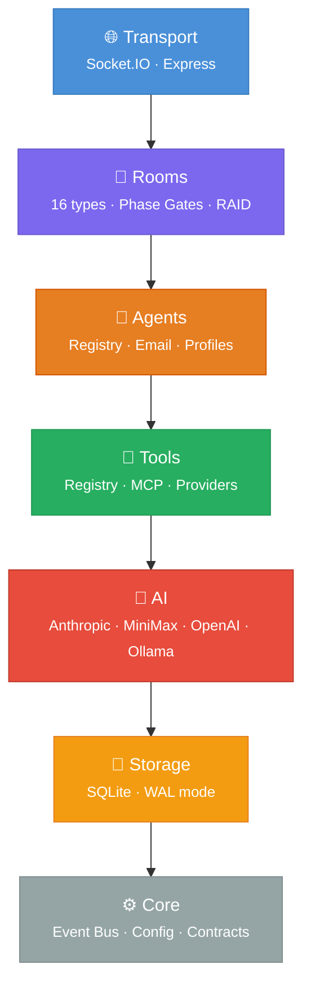

> **⬇️ Strict Layer Ordering** — Each layer can **only** import from layers below it. No circular dependencies. Enforced by `npm run validate` and CI.

<details>
<summary>📊 <b>Layer Details</b> (click to expand)</summary>

| Layer | Directory | Files | Depends On |
|:------|:----------|:------|:-----------|
| 🌐 **Transport** | `src/transport/` | Socket handlers, Zod schemas | Rooms, Agents, Tools, Core |
| 🏢 **Rooms** | `src/rooms/` | 29 files — room manager, 16 room types, phase gates, RAID, chat orchestrator | Agents, Tools, AI, Storage, Core |
| 🤖 **Agents** | `src/agents/` | 7 files — registry, email, sessions, conversation loop, stats, routing, badges | Tools, AI, Storage, Core |
| 🔧 **Tools** | `src/tools/` | 12 files — registry, MCP manager/client, 7 tool providers | AI, Storage, Core |
| 🧠 **AI** | `src/ai/` | 13 files — 4 adapters, profile generation, image service, repo analysis, repo sync | Storage, Core |
| 💾 **Storage** | `src/storage/` | SQLite with WAL, 30 tables, 59 indexes | Core |
| ⚙️ **Core** | `src/core/` | Event bus, config, logger, contracts | Nothing (foundation) |

</details>

---

## 🏢 The Spatial Model

```mermaid
graph TD
    B["🏢 Building<br/><small>Project Container</small>"]
    F1["🏗️ Strategy Floor"]
    F2["🏗️ Collaboration Floor"]
    F3["🏗️ Execution Floor"]
    F4["🏗️ Governance Floor"]
    F5["🏗️ Operations Floor"]
    F6["🏗️ Integration Floor"]

    R1["🚪 Strategist Office"]
    R2["🚪 Building Architect"]
    R3["🚪 Discovery"]
    R4["🚪 Architecture"]
    R5["🚪 War Room"]
    R13["🚪 Research"]
    R6["🚪 Code Lab"]
    R7["🚪 Testing Lab"]
    R14["🚪 Documentation"]
    R8["🚪 Review"]
    R15["🚪 Security Review"]
    R9["🚪 Deploy"]
    R16["🚪 Monitoring"]
    R10["🚪 Data Exchange"]
    R11["🚪 Provider Hub"]
    R12["🚪 Plugin Bay"]

    B --> F1 & F2 & F3 & F4 & F5 & F6
    F1 --> R1 & R2
    F2 --> R3 & R4 & R5 & R13
    F3 --> R6 & R7 & R14
    F4 --> R8 & R15
    F5 --> R9 & R16
    F6 --> R10 & R11 & R12

    style B fill:#2C3E50,color:#fff
    style F1 fill:#8E44AD,color:#fff
    style F2 fill:#2980B9,color:#fff
    style F3 fill:#27AE60,color:#fff
    style F4 fill:#E67E22,color:#fff
    style F5 fill:#E74C3C,color:#fff
    style F6 fill:#1ABC9C,color:#fff
```

| Floor | Purpose | Rooms |
|:------|:--------|:------|
| 🟣 **Strategy** | Phase Zero — goals, building layout | Strategist Office, Building Architect |
| 🔵 **Collaboration** | Planning, requirements, design, incidents | Discovery, Architecture, War Room, Research |
| 🟢 **Execution** | Implementation, verification, documentation | Code Lab, Testing Lab, Documentation |
| 🟠 **Governance** | Quality gates, security, sign-off | Review, Security Review |
| 🔴 **Operations** | Deployment, monitoring, release | Deploy, Monitoring |
| 🩵 **Integration** | External I/O, plugins, providers | Data Exchange, Provider Hub, Plugin Bay |

---

## 🚪 Room Types

Overlord ships with **16 built-in room types**. Custom rooms can be added via the Lua plugin system.

| Room | Floor | Scope | Key Constraint |
|:-----|:------|:------|:---------------|
| `strategist` | Strategy | 📖 Read-only | Consultation — 12 Quick Start templates incl. desktop/mobile/widget |
| `building-architect` | Strategy | 📖 Read-only | Custom floor/room layout design |
| `discovery` | Collaboration | 📖 Read-only | Requirements gathering with smart question rules |
| `architecture` | Collaboration | 📖 Read-only | System design — native toolchain planning support |
| `research` | Collaboration | 📖 Read-only | Requirements gathering, competitive analysis, citations |
| `code-lab` | Execution | ✏️ **Read-write** | Full write access, scoped to assigned files |
| `testing-lab` | Execution | 📖 Read-only | **NO `write_file`** — E2E tests (Playwright), screenshots, any test runner |
| `documentation` | Execution | ✏️ **Read-write** | User guides, API docs, READMEs |
| `review` | Governance | 📖 Read-only | GO/NO-GO decisions with evidence |
| `security-review` | Governance | 📖 Read-only | Vulnerability assessment, OWASP, dependency scanning |
| `deploy` | Operations | ✏️ **Read-write** | Desktop artifact packaging (DMG/AppImage/MSI) + web deploy |
| `monitoring` | Operations | ✏️ **Read-write** | Observability setup, alerting, health dashboards |
| `war-room` | Collaboration | ✏️ **Read-write** | Elevated access — incident response |
| `data-exchange` | Integration | ↔️ Varies | External data import/export |
| `provider-hub` | Integration | 📖 Read-only | AI provider configuration |
| `plugin-bay` | Integration | 📖 Read-only | Plugin lifecycle management |

> **🔒 Security:** The Testing Lab **cannot** access `write_file` — not because of a prompt instruction, but because the tool literally doesn't exist in its room contract. This is **structural enforcement**.

---

## 🔄 Phase System

```
strategy ──► discovery ──► architecture ──► execution ──► review ──► deploy
                                                │                    │
                                                ▼                    ▼
                                           war-room            war-room
                                          (on error)          (on failure)
```

| Phase | What Happens | Gate Requirement |
|:------|:-------------|:-----------------|
| 🟣 **Strategy** | Strategist asks consultative questions, produces building blueprint | Blueprint exit document |
| 📋 **Discovery** | Requirements gathering, gap analysis, risk assessment | Requirements document |
| 📐 **Architecture** | Task breakdown, dependency graph, tech decisions | Architecture document |
| ⚡ **Execution** | Code Lab writes code (scoped), Testing Lab verifies (no write) | Working code + passing tests |
| 🔍 **Review** | Reviewer provides GO / NO-GO / CONDITIONAL verdict | Reviewer sign-off with evidence |
| 🚀 **Deploy** | Release management, health checks, rollback plans | Deployment confirmation |

<details>
<summary>🚦 <b>Gate Verdicts</b></summary>

| Verdict | Meaning | Result |
|:--------|:--------|:-------|
| ✅ **GO** | Phase passes | Building advances automatically |
| ❌ **NO-GO** | Phase fails | Returns to current phase for remediation |
| ⚠️ **CONDITIONAL** | Passes with conditions | Conditions must be resolved before auto-advance |

</details>

---

## 🧠 AI Providers

| Provider | Status | Model | Speed | Context |
|:---------|:-------|:------|:------|:--------|
| **Anthropic** | ✅ Full | Claude Sonnet 4 | — | 200K |
| **MiniMax** | ✅ Full | M2.5 / M2.5-highspeed | ~60 / ~100 tps | 204K |
| **OpenAI** | ✅ Full | GPT-4o | — | 128K |
| **Ollama** | ✅ Full | Llama 3 (local) | Varies | Varies |

> **💡 Provider-per-Room:** Anthropic powers reasoning-heavy rooms (Discovery, Architecture, Review). MiniMax M2.7 powers coding rooms (Code Lab, Testing Lab). Configure per room via environment variables.

---

## 🚀 Quick Start

### Prerequisites

- **Node.js** ≥ 20.0.0
- At least one AI provider API key (or a running Ollama instance)

### Install & Run

```bash
# Clone
git clone https://github.com/twitchyvr/Overlord-v2.git
cd Overlord-v2

# Install
npm install

# Configure — add at least one AI provider key
cp .env.example .env
# Edit .env and add your ANTHROPIC_API_KEY, MINIMAX_API_KEY, or OPENAI_API_KEY

# Launch (database auto-initializes on first run)
npm run dev
```

**→ Open `http://localhost:4000`** — your local git repos are auto-discovered as buildings. Press **Play** on any building to start AI analysis.

<details>
<summary>🐳 <b>Docker Setup</b> (click to expand)</summary>

#### Dev Container (VS Code)

1. Open project in VS Code
2. Click **"Reopen in Container"** when prompted
3. Container auto-installs dependencies, builds native modules, forwards port 4000

#### Production Docker

```bash
# Build multi-stage production image
docker build -t overlord-v2 .

# Run
docker run -d \
  --name overlord-v2 \
  -p 4000:4000 \
  -v overlord_data:/app/data \
  -e ANTHROPIC_API_KEY=your-key \
  -e SESSION_SECRET=your-secret \
  overlord-v2
```

</details>

<details>
<summary>⚙️ <b>Environment Variables</b> (click to expand)</summary>

#### Server

| Variable | Default | Description |
|:---------|:--------|:------------|
| `PORT` | `4000` | HTTP server port |
| `NODE_ENV` | `development` | Environment mode |
| `LOG_LEVEL` | `info` | Pino log level |

#### AI Providers

| Variable | Default | Description |
|:---------|:--------|:------------|
| `ANTHROPIC_API_KEY` | — | Anthropic API key |
| `ANTHROPIC_MODEL` | `claude-sonnet-4-20250514` | Model ID |
| `MINIMAX_API_KEY` | — | MiniMax API key |
| `MINIMAX_BASE_URL` | `https://api.minimax.io/anthropic` | MiniMax endpoint |
| `MINIMAX_MODEL` | `MiniMax-M2.7` | Model ID |
| `OPENAI_API_KEY` | — | OpenAI API key |
| `OPENAI_MODEL` | `gpt-4o` | Model ID |
| `OLLAMA_BASE_URL` | `http://localhost:11434` | Ollama endpoint |
| `OLLAMA_MODEL` | `llama3` | Model ID |

#### Room Provider Assignments

| Variable | Default | Description |
|:---------|:--------|:------------|
| `PROVIDER_DISCOVERY` | `anthropic` | Discovery rooms |
| `PROVIDER_ARCHITECTURE` | `anthropic` | Architecture rooms |
| `PROVIDER_CODE_LAB` | `minimax` | Code Lab rooms |
| `PROVIDER_TESTING_LAB` | `minimax` | Testing Lab rooms |
| `PROVIDER_REVIEW` | `anthropic` | Review rooms |
| `PROVIDER_DEPLOY` | `anthropic` | Deploy rooms |

#### Features & Security

| Variable | Default | Description |
|:---------|:--------|:------------|
| `DB_PATH` | `./data/overlord.db` | SQLite database path |
| `SESSION_SECRET` | `dev-secret-change-in-production` | Session signing secret |
| `CORS_ORIGIN` | `http://localhost:4000` | Allowed CORS origin |
| `MCP_SERVERS_CONFIG` | `./mcp-servers.json` | MCP servers config path |
| `ENABLE_PLUGINS` | `false` | Enable plugin system |
| `ENABLE_LUA_SCRIPTING` | `false` | Enable Lua scripting |

</details>

---

## 🧪 Testing

```bash
npm test                # Run all tests (Vitest)
npm run test:watch      # Watch mode
npm run test:coverage   # V8 coverage report
npm run validate        # Full CI pipeline: typecheck + lint + test
```

**146 test files · 4,685 tests** across unit, integration, and E2E — organized by layer:

<details>
<summary>📁 <b>Test Structure</b></summary>

```
tests/
├── unit/
│   ├── core/           # Bus, config, contracts, logger
│   ├── storage/        # Database operations
│   ├── ai/             # Provider adapters
│   ├── tools/          # Registry, executor, providers
│   ├── agents/         # Registry, router, session, conversation loop
│   ├── rooms/          # Manager, all 12 room types, phase gates, RAID
│   ├── commands/       # Registry, builtins, mentions, references
│   ├── plugins/        # Loader, sandbox
│   ├── transport/      # Socket handler, schemas
│   └── ui/             # Components, engine, store, router
├── integration/
│   ├── ai-providers.test.ts       # Cross-provider integration
│   ├── full-lifecycle.test.ts     # End-to-end project lifecycle
│   └── room-tool-scoping.test.ts  # Structural tool enforcement
└── e2e/                # Playwright browser automation (multi-repo, settings, etc.)
```

</details>

---

## 🖥️ Frontend

The Overlord UI is a custom single-page application with **14 views**, **13 reusable components**, and a reactive store architecture.

| View | Purpose |
|:-----|:--------|
| 📊 **Dashboard** | Building cards, KPIs, room overview |
| 🏢 **Building** | Floor management, room editor |
| 🔄 **Phase** | Phase progression, gate visualization |
| 🚪 **Room** | Room details, agent roster, stats |
| 💬 **Chat** | Live chat with streaming, message history |
| 📋 **Tasks** | Task CRUD, detail drawer, assignment |
| ⚠️ **RAID Log** | Risk/Assumption/Issue/Decision management |
| 🤖 **Agents** | Agent profiles, stats, quick-assign |
| 📧 **Email** | Agent inbox, threading, priority |
| 🎯 **Milestones** | Milestone tracking, task assignment |
| 📡 **Activity** | Event feed, agent status updates |
| 🟣 **Strategist** | Phase Zero consultation interface |
| ⚙️ **Settings** | AI provider routing, display config |
| 📄 **Exit Doc** | Structured exit document creation |

## 📸 Screenshots

### Dashboard
Live telemetry, building cards with Play/Pause/Stop controls, and project overview. Click a building card to preview its structure in the sidebar without navigating away.

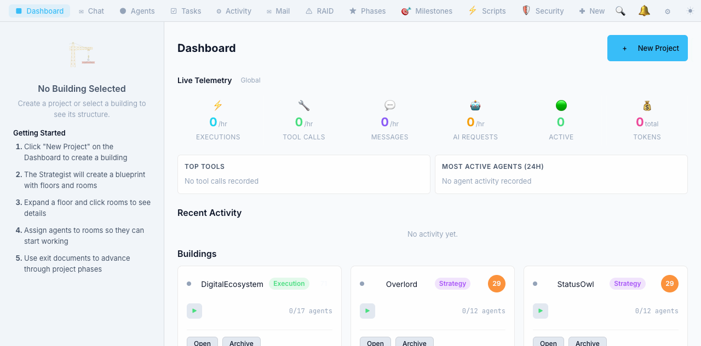

### Dashboard — Building Selected
Selecting a building populates the sidebar with floors, rooms, and agent counts while staying on the dashboard.

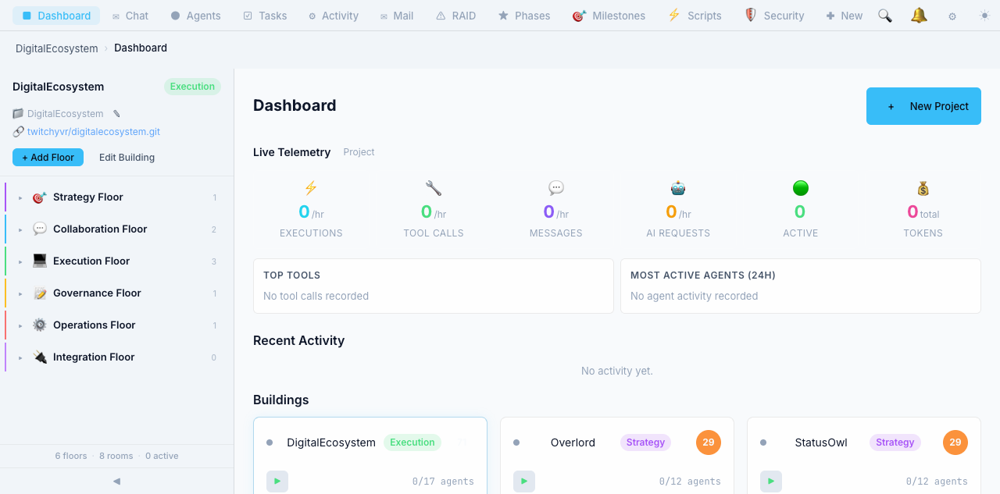

### Chat
Real-time conversation with AI agents. Agent names are clickable — opening a detail drawer with profile, stats, token usage, and activity log. Use `/` for commands and `@` to mention agents.

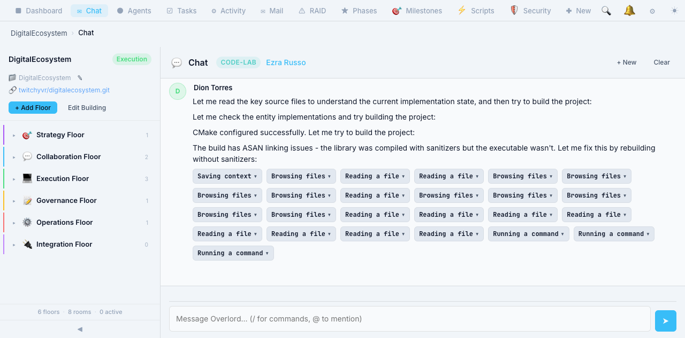

### Agents
Agent roster with profile cards, activity badges (thinking, coding, reading), room assignments, token usage, and auto-assign. Click any agent to open their full detail panel.

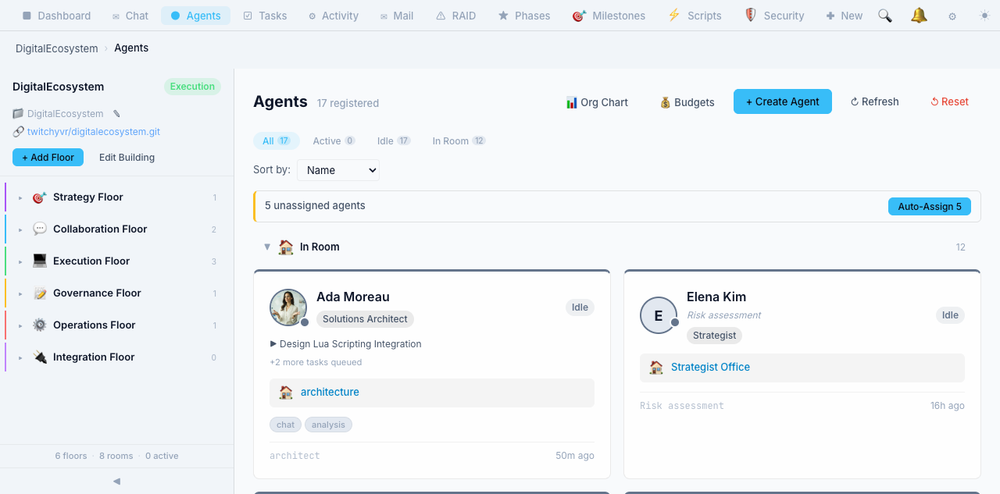

### Tasks
AI-created tasks with priorities, phase assignments, and milestone linking. Tasks progress from Pending to In Progress to Done as agents work through them.

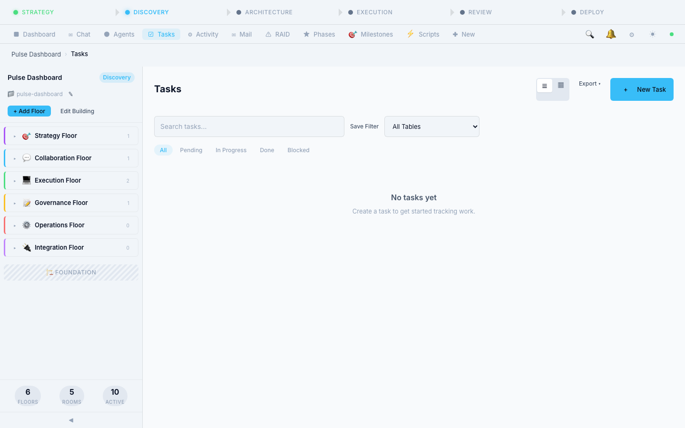

### Phase Gates
Visual stepper showing project progression from Strategy through Deploy. Gates auto-sign in Easy mode, advancing phases automatically.

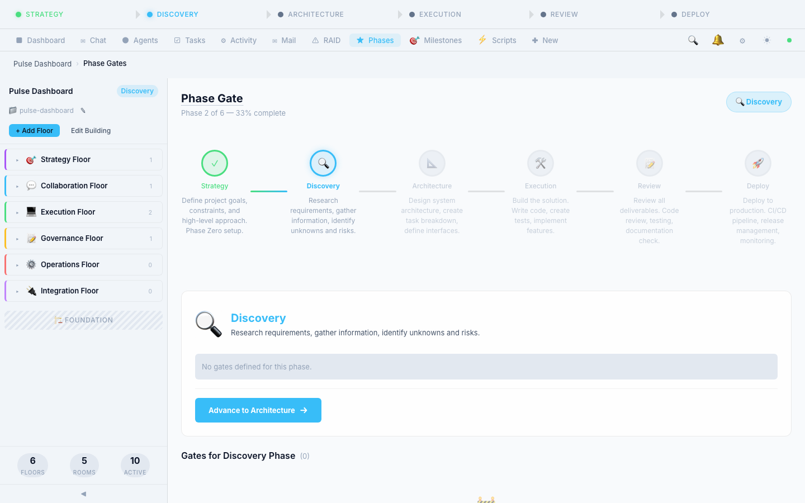

### RAID Log
Risks, Assumptions, Issues, and Decisions — auto-populated by the strategist during codebase analysis. Filterable by type and status.

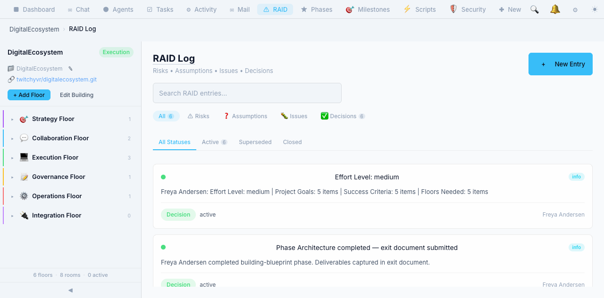

### Activity Feed
Real-time event feed with 24+ event types — agent actions, tool calls, phase transitions, building lifecycle events. Filter by Rooms, Agents, Tools, or Phase Gates.

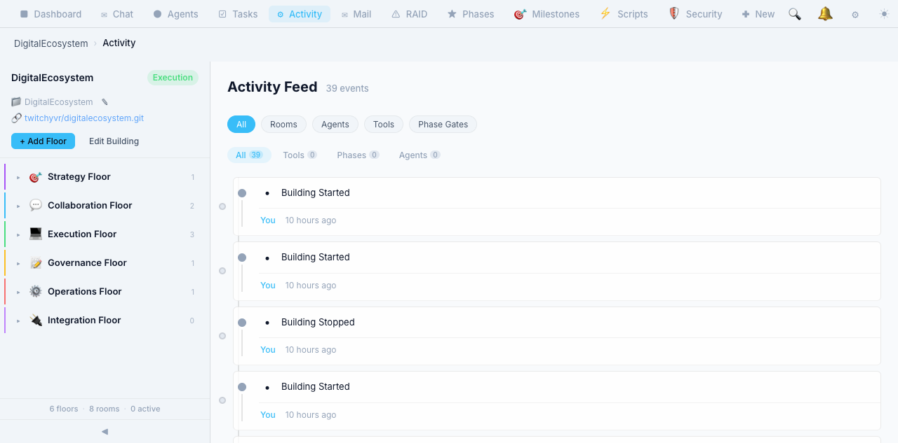

### Agent Mail
Split-pane email view with inbox/sent/all tabs, search, and threaded conversations between agents and the project owner.

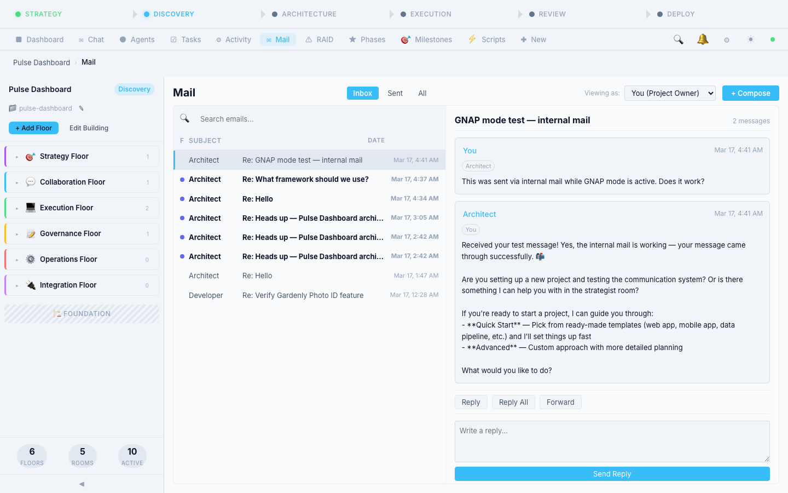

### Milestones
Milestone tracking with linked tasks and progress bars. Auto-created by the strategist with tasks linked to milestones.

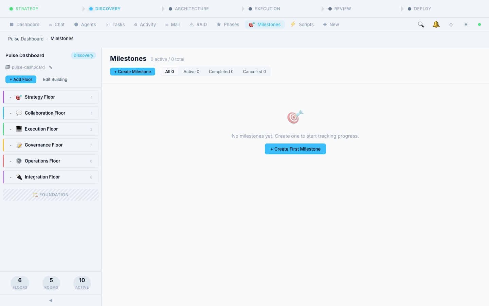

### Plugins
29 built-in plugins including Agent Activity Tracker, Changelog Generator, Code Complexity Alert, Daily Standup, Deadline Tracker, Secret Guard, and more.

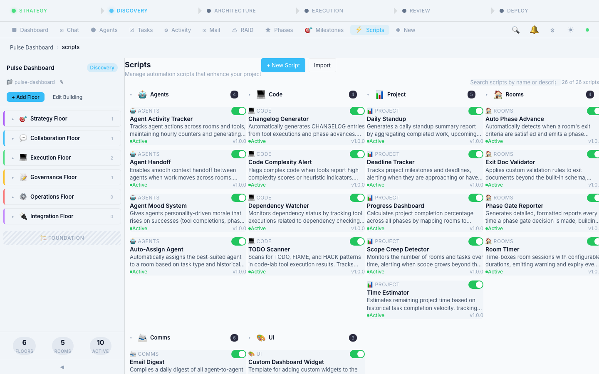

---

## 📁 Project Structure

<details>
<summary>🗂️ <b>Full directory tree</b> (click to expand)</summary>

```
Overlord-v2/
│
├── src/
│   ├── core/                      # ⚙️ Foundation (no dependencies)
│   │   ├── bus.ts                 #    EventEmitter3 event bus
│   │   ├── config.ts              #    Zod-validated configuration
│   │   ├── contracts.ts           #    Types, Result pattern, Zod schemas
│   │   └── logger.ts              #    Pino structured logger
│   │
│   ├── storage/                   # 💾 Database
│   │   └── db.ts                  #    SQLite, migrations, 30 tables, 59 indexes
│   │
│   ├── ai/                        # 🧠 AI Providers
│   │   ├── ai-provider.ts         #    Adapter registry & dispatcher
│   │   ├── adapters/
│   │   │   ├── anthropic.ts       #    Anthropic Claude
│   │   │   ├── minimax.ts         #    MiniMax M2.7
│   │   │   ├── openai.ts          #    OpenAI GPT-4o
│   │   │   └── ollama.ts          #    Ollama (local)
│   │   ├── profile-generator.ts   #    AI-generated agent bios
│   │   ├── profile-name-generator.ts # Agent name generation
│   │   ├── minimax-image.ts       #    MiniMax headshot generation
│   │   ├── agent-photo-store.ts   #    Photo file management
│   │   ├── repo-analysis-service.ts # Multi-repo AI analysis
│   │   └── repo-sync-service.ts    # Upstream change detection
│   │
│   ├── tools/                     # 🔧 Tools
│   │   ├── tool-registry.ts       #    Registration & lookup
│   │   ├── tool-executor.ts       #    Room-scoped execution
│   │   ├── mcp-manager.ts         #    MCP server lifecycle
│   │   ├── mcp-client.ts          #    JSON-RPC MCP client
│   │   └── providers/
│   │       ├── filesystem.ts      #    read/write/patch/list
│   │       ├── shell.ts           #    bash execution
│   │       ├── web.ts             #    web_search
│   │       ├── notes.ts           #    record/recall notes
│   │       ├── data-exchange.ts   #    External data I/O
│   │       ├── provider-hub.ts    #    AI provider management
│   │       └── plugin-bay.ts      #    Plugin lifecycle
│   │
│   ├── agents/                    # 🤖 Agents
│   │   ├── agent-registry.ts      #    CRUD, profiles, room access
│   │   ├── agent-email.ts         #    Agent-to-agent messaging
│   │   ├── agent-session.ts       #    Conversation state
│   │   ├── conversation-loop.ts   #    AI → tool → response loop
│   │   ├── agent-router.ts        #    Message routing
│   │   ├── agent-stats.ts         #    Activity metrics
│   │   └── security-badge.ts      #    Role-based access
│   │
│   ├── rooms/                     # 🏢 Rooms
│   │   ├── room-manager.ts        #    Room lifecycle
│   │   ├── building-manager.ts    #    Building + Floor CRUD
│   │   ├── building-onboarding.ts #    Auto-provision on create
│   │   ├── chat-orchestrator.ts   #    chat:message → AI → response
│   │   ├── phase-gate.ts          #    GO/NO-GO checkpoints
│   │   ├── phase-zero.ts          #    Strategist handlers
│   │   ├── raid-log.ts            #    RAID entry management
│   │   ├── scope-change.ts        #    Scope change protocol
│   │   ├── escalation-handler.ts  #    Stale gate detection
│   │   ├── citation-tracker.ts    #    Cross-room references
│   │   └── room-types/            #    12 built-in room types
│   │       ├── base-room.ts
│   │       ├── strategist.ts
│   │       ├── building-architect.ts
│   │       ├── discovery.ts
│   │       ├── architecture.ts
│   │       ├── code-lab.ts
│   │       ├── testing-lab.ts
│   │       ├── review.ts
│   │       ├── deploy.ts
│   │       ├── war-room.ts
│   │       ├── data-exchange.ts
│   │       ├── provider-hub.ts
│   │       └── plugin-bay.ts
│   │
│   ├── commands/                  # 💬 Commands
│   │   ├── command-registry.ts    #    Slash command registration
│   │   ├── builtin-commands.ts    #    /help /status /phase etc.
│   │   ├── mention-handler.ts     #    @mention fuzzy matching
│   │   └── reference-resolver.ts  #    #issue #task resolution
│   │
│   ├── plugins/                   # 🔌 Plugins
│   │   ├── plugin-loader.ts       #    Discovery & loading
│   │   ├── plugin-sandbox.ts      #    Sandboxed execution
│   │   ├── lua-sandbox.ts         #    Lua via wasmoon
│   │   └── contracts.ts           #    Plugin manifest schema
│   │
│   ├── transport/                 # 🌐 Transport
│   │   ├── socket-handler.ts      #    80+ Socket.IO event handlers
│   │   └── schemas.ts             #    120+ Zod message schemas
│   │
│   └── server.ts                  #    Entry point
│
├── public/ui/                     # 🖥️ Frontend
│   ├── engine/                    #    Core framework (store, router, socket bridge)
│   ├── components/                #    13 reusable UI components
│   ├── views/                     #    14 full-page views
│   └── css/                       #    8 stylesheets (tokens, responsive, etc.)
│
├── tests/                         #    146 test files, 4,685 tests (unit + integration + e2e)
├── .devcontainer/                 #    VS Code Dev Container config
├── .github/                       #    Actions, issue templates, PR template
├── Dockerfile                     #    Multi-stage Alpine build
└── docker-compose.prod.yml        #    Production Compose config
```

</details>

---

## 🛠️ Tech Stack

| Component | Technology |
|:----------|:-----------|
| 🟦 Language | **TypeScript 5.7+** (strict mode) |
| 🟩 Runtime | **Node.js 20+** |
| 💾 Database | **SQLite** via better-sqlite3 (WAL mode) |
| 🧠 AI Providers | **Anthropic**, **MiniMax M2.7**, **OpenAI**, **Ollama** |
| 🌐 Transport | **Socket.IO 4** + **Express 5** |
| ✅ Validation | **Zod 3** |
| 📡 Events | **EventEmitter3** |
| 📋 Logging | **Pino** |
| 🧪 Testing | **Vitest 3** + V8 coverage |
| 🔍 Linting | **ESLint 9** + typescript-eslint |
| 🔄 CI/CD | **GitHub Actions** |
| 🐳 Container | **Docker** (multi-stage Alpine) |
| 🔌 Plugins | **wasmoon** (Lua runtime) |

---

## 📋 Available Scripts

| Command | Description |
|:--------|:------------|
| `npm run dev` | Start dev server with hot reload (tsx watch) |
| `npm run build` | Compile TypeScript to `dist/` |
| `npm start` | Run compiled production server |
| `npm test` | Run all 4,685 tests (Vitest) |
| `npm run test:e2e` | Run Playwright E2E tests |
| `npm run test:coverage` | Tests with V8 coverage |
| `npm run lint` | ESLint check |
| `npm run typecheck` | TypeScript type checking |
| `npm run validate` | Verify layer ordering (architecture compliance) |

---

## 🤝 Contributing

| Branch | Purpose |
|:-------|:--------|
| `main` | 🔒 Stable, protected — PRs required, CI must pass |
| `feat/*` | ✨ New features |
| `fix/*` | 🐛 Bug fixes |
| `docs/*` | 📖 Documentation |
| `refactor/*` | ♻️ Code restructuring |

### Workflow

1. **Create a GitHub Issue** for the work
2. **Branch** from `main` → `feat/my-feature` or `fix/my-fix`
3. **Commit** using [Conventional Commits](https://www.conventionalcommits.org/): `type(scope): subject`
4. **Open a PR** with summary, test plan, and `Closes #N`
5. **Pass CI**: lint + typecheck + tests + architecture check + build
6. **Get 1 review approval** — main is branch-protected
7. **Squash merge** — delete branch immediately after merge

### Code Standards

- All source: TypeScript with `strict: true`
- Validation: Zod schemas for runtime checks
- I/O: `ok(data)` / `err(code, message)` Result pattern
- Imports: `.js` extension (Node16 resolution)
- No `any` without justification comment

> 📖 **See the [Wiki Contributing page](https://github.com/twitchyvr/Overlord-v2/wiki/Contributing) for full guidelines.**

---

## 📝 Changelog

See **[CHANGELOG.md](CHANGELOG.md)** for detailed version history.

Overlord v2 follows [Semantic Versioning](https://semver.org/) — `vMAJOR.MINOR.PATCH`.

---

## 🙏 Acknowledgments

### GNAP (Git-Native Agent Protocol)

Overlord v2's agent messaging system is built on the [**GNAP (Git-Native Agent Protocol)**](https://github.com/farol-team/gnap) created by [**Farol Labs**](https://github.com/farol-team).

GNAP provides a decentralized, git-native coordination protocol for AI agents and humans — messages stored as JSON files in a shared git repo, with push-to-send and pull-to-receive semantics. Overlord integrates GNAP as an optional persistent messaging backend alongside the real-time event bus, giving agents both sub-second communication and a full git-backed audit trail.

> GNAP is licensed under the **MIT License** — Copyright (c) 2026 Farol Labs.

Thank you to the Farol Labs team for creating GNAP and for [collaborating with us](https://github.com/twitchyvr/Overlord-v2/issues/277) on its integration into Overlord.

### Community Contributors

- [**@m13v**](https://github.com/m13v) — File locking patterns, PID liveness checks with start time comparison, hostname disambiguation for multi-machine locks, browser lock design from [browser-lock](https://github.com/m13v/browser-lock). Extensive collaboration on [parallel agent concurrency](https://github.com/twitchyvr/Overlord-v2/issues/806).

---

## 📄 License

[MIT](LICENSE) — Copyright © 2026 Matt Rogers

---

<div align="center">

**🏢 Overlord v2** — *Where rooms define behavior, not agents.*

[📖 Wiki](https://github.com/twitchyvr/Overlord-v2/wiki) · [🐛 Report Bug](https://github.com/twitchyvr/Overlord-v2/issues/new?template=bug_report.md) · [✨ Request Feature](https://github.com/twitchyvr/Overlord-v2/issues/new?template=feature_request.md)

</div>
