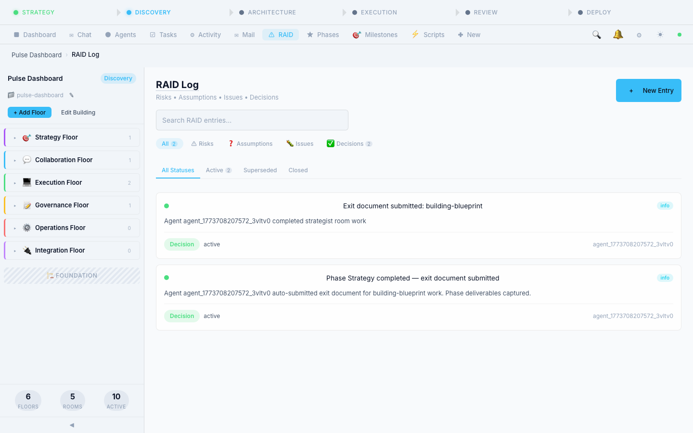

# Overlord v2 Wiki

Welcome to the **Overlord v2** wiki — the comprehensive reference for the Building/Room/Table agentic framework.

> **"Don't change the agent — change the framework."**

## Quick Navigation

### Core Concepts
- [[Philosophy]] — Design principles and v1 lessons learned
- [[Spatial Model]] — Building / Floor / Room / Table / Chair hierarchy
- [[Universal IO Contracts]] — The `ok()`/`err()` pattern that everything follows

### Architecture
- [[Layer Stack]] — Transport > Rooms > Agents > Tools > AI > Storage > Core
- [[Database Schema]] — All tables, indexes, and relationships
- [[Event Bus]] — The thin pub/sub backbone replacing v1's 2300-line hub

### The Building
- [[Floors]] — The 7 floor categories
- [[Room Types]] — All implemented room types with contracts
- [[Tables and Chairs]] — Work modes within rooms

### Room System
- [[Room Contracts]] — Tools, file scope, exit templates, escalation
- [[Exit Documents]] — Structured output required to leave a room
- [[Phase Gates]] — GO/NO-GO/CONDITIONAL checkpoints
- [[RAID Log]] — Risks, Assumptions, Issues, Decisions

### Agents
- [[Agent System]] — 10-line identity cards, not 200-line prompts
- [[Agent Router]] — Message routing, @mentions, #references
- [[Badge Access]] — Room access control via agent badges

### Tools
- [[Tool Registry]] — All built-in tools and their categories
- [[Structural Tool Access]] — If it's not in the room's list, it doesn't exist

### AI Providers
- [[Provider Agnostic AI]] — Adapter pattern for Anthropic, MiniMax, OpenAI, Ollama
- [[Room Provider Assignment]] — Different models for different rooms

### Transport
- [[Socket Events]] — All socket.io events organized by domain
- [[REST API]] — HTTP endpoints

### Operations
- [[Setup Guide]] — Installation, configuration, first run
- [[Configuration Reference]] — All .env variables
- [[Database Operations]] — Migrations, seeding, backups
- [[Scripts Reference]] — npm scripts and utility scripts

### Development
- [[Contributing]] — Branch strategy, PR requirements, CI/CD
- [[Testing Guide]] — Unit, integration, E2E testing
- [[Architecture Compliance]] — Layer dependency checker
- [[Plugin Development]] — Creating custom room types and tools

### Implementation
- [[Implementation Phases]] — 8-phase roadmap from v1 stabilization to plugins
- [[Migration from v1]] — What changed and why

---

## Visual Tour

A walkthrough of Overlord v2's major views and features.

### Dashboard
KPIs, phase progress, building floor structure, and dev loop pipeline.

### Chat
Real-time conversation with AI agents. Use `/` for commands and `@` to mention agents.

### Agents
Agent roster with profile cards, room assignments, and status indicators.

### Agent Mail
Split-pane email with inbox/sent/all tabs, search, and threaded agent-to-agent conversations.

### Phase Gates
Visual stepper from Strategy through Deploy with gate status and advance controls.

### RAID Log
Risks, Assumptions, Issues, and Decisions — filterable by type and status.

### Tasks
Task management with filtering, assignment, and detail drawers.

### Activity Feed
Real-time event feed showing agent actions, room transitions, and system events.

### Milestones
Milestone tracking tied to project phases with task assignment and progress.

### Lua Scripts
In-browser Lua IDE with 26 built-in scripts for customizing Overlord behavior.

