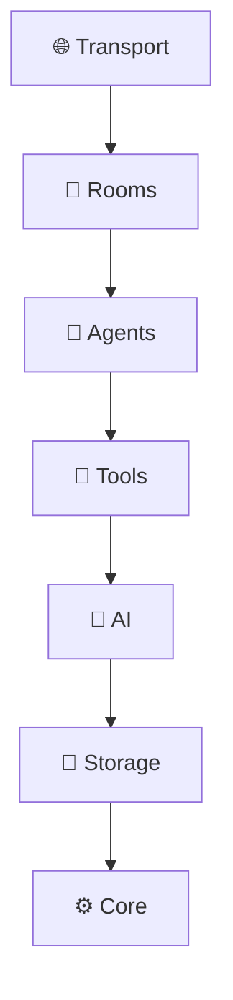

# Plan: Overhaul GitHub Wiki + Beautify README.md

## Context

The Overlord v2 codebase has grown substantially since the wiki was last updated. The wiki is:
1. **Missing entire systems** — Email, MCP Integration, Commands, Chat Orchestrator, Agent Profiles/Photos, UI Architecture, Frontend Components, Building Onboarding, Escalation, Citation Tracker
2. **Severely outdated** — Provider-Agnostic AI says "All stubs" (they're fully implemented), Implementation Phases says Phase 1 is "Current" (we're past Phase 6), Socket Events is missing 30+ handlers, Tool Registry is missing MCP/data-exchange/provider-hub/plugin-bay tools, Agent System is missing profiles/email/stats/photos
3. **Bland formatting** — Plain markdown with basic tables, no visual hierarchy, no emoji, no callouts/admonitions, no badges, no diagrams, no collapsible sections, no status indicators

The README is functional but plain — needs badges, visual polish, screenshots, and feature highlights.

---

## Scope

### Part 1: Wiki Overhaul (35 pages)

All pages get the enhanced formatting treatment:
- 🏷️ **Header badges** — status/phase indicators per page
- 📐 **Mermaid diagrams** — architecture flows, sequence diagrams, state machines (GitHub wikis render Mermaid)
- 💡 **Callout blocks** — `> **⚠️ Warning:**`, `> **💡 Tip:**`, `> **🔒 Security:**` blockquotes
- 📂 **Collapsible sections** — `<details><summary>` for long code/tables
- 🎯 **Emoji visual hierarchy** — section markers, status indicators, feature tags
- 🔗 **Rich cross-linking** — every page links to related pages, breadcrumbs
- 📊 **Status tables** — with ✅/⚠️/❌ visual indicators
- 🧭 **Breadcrumb navigation** — `Home > Architecture > Layer Stack`

#### Pages to UPDATE (existing — outdated content + bland formatting):

| # | Page | Key Changes |
|---|------|-------------|
| 1 | **Home.md** | Complete redesign — hero section, feature grid, quick-nav cards with emoji, "What's New" section |
| 2 | **_Sidebar.md** | Add emoji icons per section, new pages, visual grouping |
| 3 | **_Footer.md** | Add badges, version, links |
| 4 | **Layer-Stack.md** | Add Mermaid layer diagram, update module tables with ALL current files |
| 5 | **Agent-System.md** | Add profiles, photos, email, stats, conversation loop, security badges |
| 6 | **Provider-Agnostic-AI.md** | Remove "All stubs" — document full implementations, MiniMax M2.5 details, thinking/caching |
| 7 | **Room-Types.md** | Add Data Exchange, Provider Hub, Plugin Bay rooms (currently missing), update tools |
| 8 | **Tool-Registry.md** | Add MCP tools, data-exchange, provider-hub, plugin-bay tools, update room-tool matrix |
| 9 | **Socket-Events.md** | Add ALL 40+ event handlers (currently shows ~15), add task/todo/email/milestone/activity domains |
| 10 | **Implementation-Phases.md** | Update statuses (Phase 0-5: ✅ Complete, Phase 6: 🔄 In Progress, Phase 7: 📋 Planned) |
| 11 | **Database-Schema.md** | Add agent_emails, agent_email_recipients, agent_activity_log, agent_stats, plans, citations tables |
| 12 | **Philosophy.md** | Enhance formatting, add callouts |
| 13 | **Spatial-Model.md** | Add Mermaid hierarchy diagram, enhance with emoji |
| 14 | **Universal-IO-Contracts.md** | Enhance formatting |
| 15 | **Event-Bus.md** | Update with current event catalog |
| 16 | **Floors.md** | Add Integration Floor (missing) |
| 17 | **Room-Contracts.md** | Update with new rooms |
| 18 | **Exit-Documents.md** | Enhance formatting |
| 19 | **Phase-Gates.md** | Add Mermaid state diagram |
| 20 | **RAID-Log.md** | Enhance formatting |
| 21 | **Agent-Router.md** | Enhance with commands system |
| 22 | **Badge-Access.md** | Enhance formatting |
| 23 | **Structural-Tool-Access.md** | Enhance formatting |
| 24 | **Room-Provider-Assignment.md** | Update with current provider defaults, MiniMax M2.5 |
| 25 | **REST-API.md** | Update if needed |
| 26 | **Setup-Guide.md** | Update with MCP config, new env vars |
| 27 | **Configuration-Reference.md** | Add MCP, plugin, AI request config sections |
| 28 | **Database-Operations.md** | Enhance formatting |
| 29 | **Scripts-Reference.md** | Update with current npm scripts |
| 30 | **Contributing.md** | Enhance formatting |
| 31 | **Testing-Guide.md** | Update test counts, enhance formatting |
| 32 | **Architecture-Compliance.md** | Enhance formatting |
| 33 | **Plugin-Development.md** | Update with Lua runtime details |
| 34 | **Tables-and-Chairs.md** | Enhance formatting |
| 35 | **Migration-from-v1.md** | Enhance formatting |

#### Pages to CREATE (new systems not documented):

| # | Page | Content |
|---|------|---------|
| 36 | **Email-System.md** | Agent-to-agent async messaging, threading, priority, recipients, UI |
| 37 | **MCP-Integration.md** | MCP manager, client, built-in server presets, tool naming, MiniMax MCP servers |
| 38 | **Commands-System.md** | Slash commands, @mentions, #references, command registry |
| 39 | **Chat-Orchestrator.md** | The critical `chat:message` → AI → `chat:response` pipeline with streaming |
| 40 | **Agent-Profiles.md** | AI-generated bios, names, photos, headshots, specializations |
| 41 | **UI-Architecture.md** | Engine, store, router, socket-bridge, component model, boot sequence |
| 42 | **Frontend-Components.md** | All 13 reusable components: button, card, modal, panel, drawer, etc. |
| 43 | **Frontend-Views.md** | All 14 views with descriptions and navigation |
| 44 | **Escalation-System.md** | Stale gate detection, war room creation, escalation rules |
| 45 | **Building-Onboarding.md** | Auto-provisioning Strategist on building creation |
| 46 | **Roadmap.md** | Current backlog highlights, thinking pipeline, MCP integration, visual feedback loop |

### Part 2: README.md Beautification

| Element | Enhancement |
|---------|-------------|
| **Header** | Project logo placeholder, tagline, badge row (build status, version, license, Node version, TypeScript) |
| **Hero section** | Feature highlights with emoji grid — spatial model, provider-agnostic, structural tool access, phase gates |
| **Architecture diagram** | Mermaid diagram replacing ASCII art |
| **Screenshots section** | Placeholder image links for Dashboard, Chat, Building, Phase views (with `<!-- screenshot -->` comments for future insertion) |
| **Quick start** | Streamlined with copy-paste blocks, expandable advanced config |
| **Feature showcase** | Collapsible feature details for each major system |
| **Tech stack** | Badge-style with icons |
| **Contributing** | Simplified with link to wiki Contributing page |
| **Footer** | License, credits, links |

---

## Files Modified

### Wiki (git repo at `/tmp/Overlord-v2.wiki/`)
- All 35 existing `.md` files — enhanced formatting + content updates
- 11 new `.md` files — new system documentation
- Total: 46 wiki pages

### README
- `/Users/mattrogers/GitRepos/Overlord-v2/README.md` — complete rewrite with enhanced formatting

---

## Execution Strategy

1. **Update `_Sidebar.md`** first — establishes new navigation structure
2. **Update `_Footer.md`** — badges and links
3. **Rewrite `Home.md`** — new landing page with feature grid
4. **Create new pages** (11 pages) — fill the gaps before updating existing
5. **Update existing pages** (32 remaining pages) — content + formatting
6. **Rewrite `README.md`** — full beautification
7. **Git push wiki changes** — `cd /tmp/Overlord-v2.wiki && git add -A && git commit && git push`

All wiki changes go through the wiki git repo. README changes go through the main repo.

---

## Formatting Standards (Applied to Every Page)

```markdown
<!-- Breadcrumb -->
> 🏠 [[Home]] > 📐 Architecture > **Layer Stack**

<!-- Status badge -->
> **Status:** ✅ Implemented — Phase 5 | **Source:** `src/agents/`

<!-- Callout blocks -->
> **💡 Tip:** Use `npm run validate` to check layer compliance.

> **⚠️ Warning:** Never import upper layers from lower layers.

> **🔒 Security:** File scope enforcement prevents path traversal.

<!-- Mermaid diagrams -->


<!-- Collapsible sections -->
<details>
<summary>📋 Full API Reference (click to expand)</summary>
...detailed content...
</details>

<!-- Status indicators in tables -->
| Feature | Status |
|---------|--------|
| Agent Registry | ✅ Complete |
| Email System | ⚠️ Needs UI Overhaul |
| GNAP Messaging | ❌ Not Implemented |
```

---

## Verification

1. Push wiki changes → verify all pages render correctly on GitHub
2. Verify Mermaid diagrams render in GitHub wiki
3. Verify collapsible `<details>` sections work
4. Verify cross-links (`[[Page Name]]`) resolve correctly
5. Verify README badges render correctly
6. Spot-check 5 pages for content accuracy against current codebase
